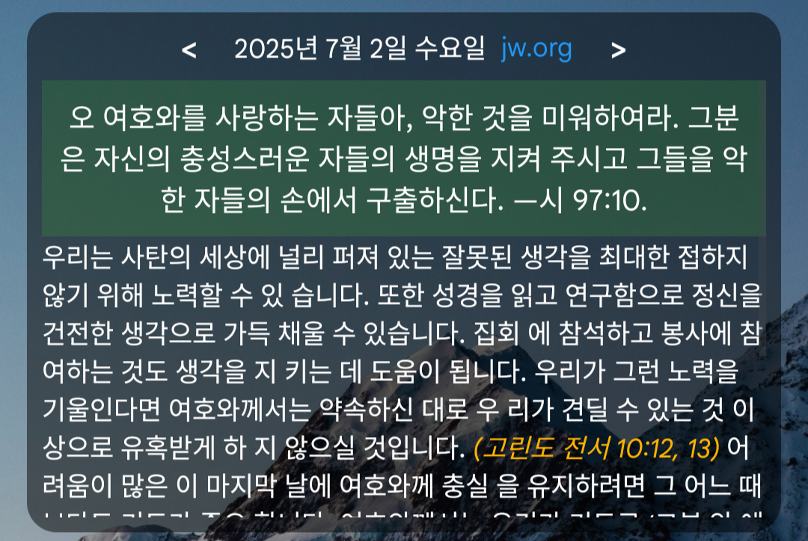

그
# 안드로이드 데일리 텍스트 앱

이 앱은 jw.org의 매일의 성경 구절을 보여주는 간단한 안드로이드 애플리케이션입니다.

## 기능

- 매일 새로운 성구 표시
- 앱 실행 시 오늘의 성구 확인 가능
- 날짜 클릭 시 오늘 날짜로 이동
- < > 버튼 클릭 시 다음/이전 날짜로 이동
- jw.org 클릭 시 현재 날짜의 Watchtower Online Library로 이동
- 페이지 이동: 손가락으로 화면을 아래로 살짝 내렸다가 다시 올리면 스크롤바가 활성화되어 빠르게 이동 가능

## 데이터 업데이트 및 자동 변환 방법

- 매년 제공되는 txt 압축파일(예: es25_KO.txt.zip)만 준비하면 됩니다.
- parse_verses_to_json.py의 ZIP_FILE 변수에 압축파일명을 지정한 뒤 실행하면,
    1. 압축 해제 →
    2. txt 파일 자동 파싱 →
    3. JSON 파일 생성(app/src/main/assets/daily_verses.json) →
    4. 사용한 txt 파일 자동 삭제
  까지 한 번에 처리됩니다.
- PDF 변환, 수동 txt 관리 없이 zip 파일만으로 데이터 갱신이 가능합니다.
- 내년에도 zip 파일명만 바꿔주면 동일하게 사용 가능합니다.

## 설치 및 사용법

1. 앱을 설치합니다
2. 위젯을 추가하여 오늘의 성경 구절을 확인합니다

## 개발 환경

- Cursor AI
- Kotlin
- Android API 21 이상
- Target API 34

## 빌드 및 설치 방법

1. 빌드

```bash
./gradlew assembleDebug
```

2. 디바이스에 APK 설치

```bash
adb install -r app/build/outputs/apk/debug/daily_text.apk
```

- USB 디버깅이 활성화된 안드로이드 기기를 연결한 후 위 명령어를 실행하면 앱이 설치됩니다.
- 이미 설치된 경우 `-r` 옵션으로 덮어쓰기 설치가 가능합니다.

## 테스트

실제 안드로이드 디바이스나 에뮬레이터에서 테스트하세요.

## 라이센스

MIT License 

생성된 APK 파일은 다음 경로에 있습니다:

최신 APK 파일은 아래 Release 페이지에서 다운로드할 수 있습니다:

[👉 Release에서 APK 다운로드](https://github.com/hanjungwoo3/daily_text/releases)

이제 이 APK를 기기나 에뮬레이터에 설치하면,
- 앱 이름이 "daily text 앱"으로 표시되고,
- 위젯 배경이 완전 투명하며,
- 날짜/제목/본문/이동 버튼 UI 및 JSON 연동,
- 날짜 이동, 스크롤, 텍스트 꽉 차게 표시 등
모든 요청하신 기능이 적용된 위젯을 사용할 수 있습니다.

추가로 확인하거나 수정할 사항이 있으면 언제든 말씀해 주세요! 

## 스크린샷


